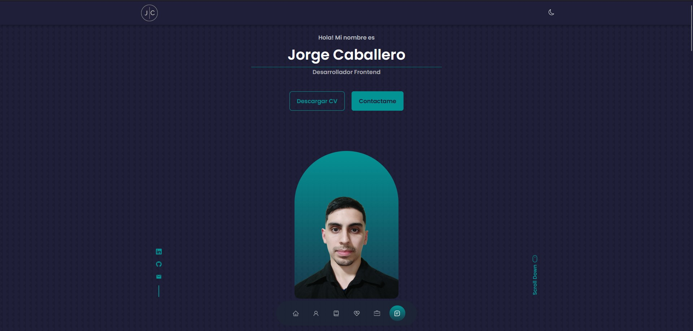

# 🖥️ Portafolio Web - Jorge Caballero 🖥️

## 📚 Preview

## 📚 Descripción del proyecto
- Portafolio web ***responsive design*** utilizando React Js.

- Desarrollado principalmente con la metodología ***Mobile First***.

- Diseñado con una interfaz de usuario ***agradable y funcional***.

- Desplazamiento suave en cada sección.

## 📚 Tecnologías utilizadas
- React Js
- JavaScript (ES6)
- Google Fonts - Libreria de fuentes de Google.
- React Icons - Libreria de iconos.
- Swiper Js - Libreria de animaciones - Slider. 

### 🖥️ Licencia
>&copy; Jorge Caballero - Todos los derechos reservados.